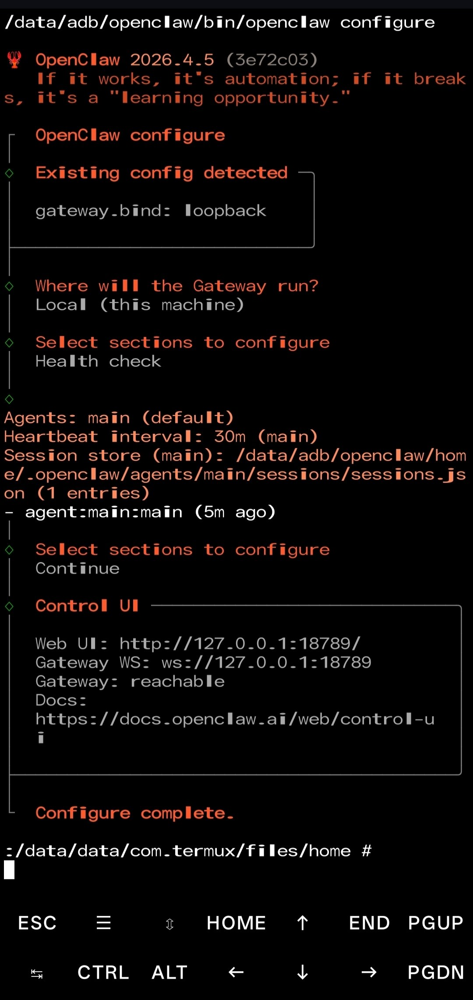
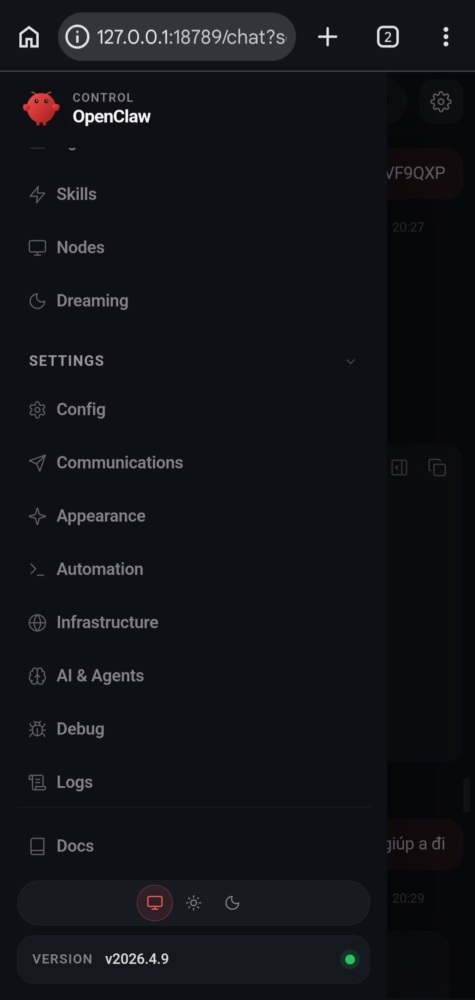

# GlibClaw

A Magisk/KernelSU module that installs [OpenClaw](https://openclaw.ai) on Android (aarch64) using a bundled glibc-node runtime.

## Screenshots

<table>
  <tr>
    <td width="50%">
      
      <p align="center"><b>Terminal Interface</b></p>
    </td>
    <td width="50%">
      
      <p align="center"><b>Dashboard</b></p>
    </td>
  </tr>
</table>

## Requirements

- Android device with root access (Magisk or KernelSU)
- Architecture: aarch64 only
- Internet connection (online version only)

## Installation

Requires internet connection during flash.

1. Download `GlibClaw-online-v1.0.1.zip`
2. Flash via Magisk / KernelSU
3. Reboot

## Setup

After reboot, open a root terminal (via [Termux](https://github.com/termux/termux-app/releases/download/v0.119.0-beta.3/termux-app_v0.119.0-beta.3+apt-android-7-github-debug_arm64-v8a.apk)) and run the following commands:

### Configure OpenClaw

```sh
su -c /data/adb/openclaw/bin/openclaw configure
```

### Check Status

```sh
su -c /data/adb/openclaw/bin/openclaw status
```

### View Logs

```sh
su -c tail -f /data/adb/openclaw/openclaw.log
```

## Directory Layout

After install, OpenClaw lives at:

```
/data/adb/openclaw/
├── bin/openclaw          # main wrapper
├── glibc-node/           # bundled Node.js runtime
├── lib/node_modules/     # OpenClaw package
└── home/.openclaw/       # user config & workspace
```

## Uninstall

Remove the module from Magisk/KernelSU app. User data at `/data/adb/openclaw/home` is preserved.

## License

MIT © TDat
